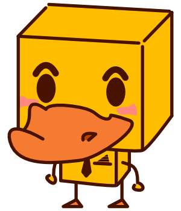

  

  

)
)

*$5 for your 5 start rating*  

### Index
- [Description](#description)
- [Resources](#resources)

### Description
Scraped all text from Power Points and PDFs provided to us. I then extracted keywords with Python using RAKE. The web app attempts to strictly match these extracted keywords. Also, all the descriptions were auto-summarized. 

### Resources
*None yet.*
